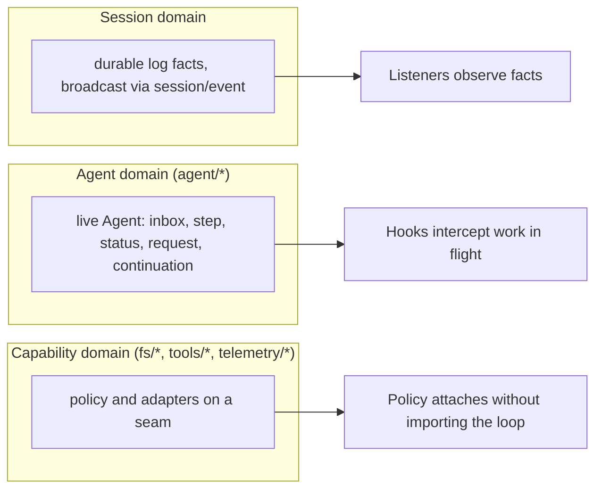

# Event Domains and Lifecycle Events

Events are the extension points of the harness: picking the right domain is the first decision in most changes. The harness organizes events into three domains, splits them into durable session facts and live extension points, and publishes generated catalogs that record every event's mode, declaration site, dispatchers and listeners.

## The three event domains

`docs/architecture.md` distinguishes three domains, each with a distinct contract:

- **Session events** are durable facts appended to the session log and broadcast through `session/event`. Use one when the fact must survive a reload.
- **Agent events** (`agent/*`) carry a live `Agent`: inbox, step, status, request, validation, continuation. Use one to observe or intercept work in flight.
- **Capability events** attach policy and adapters to a seam (`fs/*`, `tools/*`, `telemetry/*`) without importing the loop.

## Durable session events vs live extension points

`turn/*`, `step/*`, `user/message`, `assistant/*`, and `tool/*` are durable session events; the rest are live extension points across the three domains. This split is reflected in the lifecycle sequence: durable replay facts accumulate on `session/event` while live control and status travel on `agent/*`. The `assistant/message` event records every successful provider call, including content-less and `max-tokens` finishes: empty content stays out of derived history, while the durable event keeps usage and `sourceEventSeqs` listing the exact `assistant/chunk` events.

## Event modes

The event matrix classifies each event by mode:

- **`emit`** — fire-and-forget broadcast to all listeners (e.g. `session/event`, `agent/status`, `tools/result`).
- **`waterfall`** — listeners must call `next()` to delegate (e.g. `agent/pre-step`, `agent/request`, `llm/stream`, the three `tools/*` events).
- **`serial`** — exactly one listener chain, no `next()` (e.g. `agent/turn-stopping`).
- **`parallel`** — concurrent fan-out (e.g. `session/flush`).

Key lifecycle waterfalls:

| Event | Mode | Dispatched by | Notable listeners |
| --- | --- | --- | --- |
| `agent/pre-step` | waterfall | `agent-loop` | `agent-instructions`, `compaction-basic`, `plan-mode`, `tool-subagent`, … |
| `agent/request` | waterfall | `agent-loop` | `agent`, `webhook` |
| `llm/stream` | waterfall | `llm` | `agent-loop`, `llm-slots`, `session-title`, `subagent`, … |
| `tools/pre-execute` | waterfall | `tools` | `hooks-claude-code`, `hooks-codex`, `tool-jobs` |
| `tools/execute` | waterfall | `tools` | `session-checkpoint-policy`, `timeout-policy` |
| `tools/post-execute` | waterfall | `tools` | `spill-policy`, `stream-rules`, `repeat-tool-reminder`, … |

## Session event envelope

Every entry in the session log is a discriminated union over `type`, carrying a monotonic `seq`, epoch-ms `time`, `data`, and — only on surface event types — the conditional `surfaceOp`/`sourceEventSeqs` fields. Only `user/message`, `assistant/message`, and `tool/result` are surface event types: they produce LLM messages and join the ordered surface (`surfaceOp` is `'append'` or a `{ op: 'replace', start, end }` compaction range). Every non-surface event is a log-only, replayable record. Payloads are JSON-serializable (enforced at `Session.append`), and the format is pinned at `SESSION_FORMAT_VERSION = 0` — pre-release, no compatibility implied.

## Known session event vocabulary

The complete durable vocabulary is `KNOWN_SESSION_EVENT_TYPES`, generated into `packages/core/session/src/known-event-types.ts` by `scripts/gen-persistence-catalog.ts`. The persistence read path refuses to interpret a log containing a type outside this set: such a log was likely written by a newer harness, and silently skipping the event could reconstruct a wrong session. There is exactly one `session/event` emit that carries log events to listeners — a log event is not itself a Cordis event.

## Generated catalogs

Two generated documents back this page:

- `docs/event-producer-consumer.md` — the event map: every harness-owned event with its mode, declaration site, dispatchers and listeners, produced by `scripts/gen-doc-graphs.ts`.
- `docs/persistence-catalog.md` — the complete persisted `SessionEvent` envelope and every member of the merge-extensible `SessionEventMap`, produced by `scripts/gen-persistence-catalog.ts` and verified fresh by `pnpm run verify-persistence-catalog` (part of `doc-sync`).

## Related pages

- [Session, Step and Turn Lifecycle](turn-flow.md) — how these events drive the agent loop.
- [Session Data Plane](../platform/session-data-plane.md) — how the durable log is persisted and projected.
